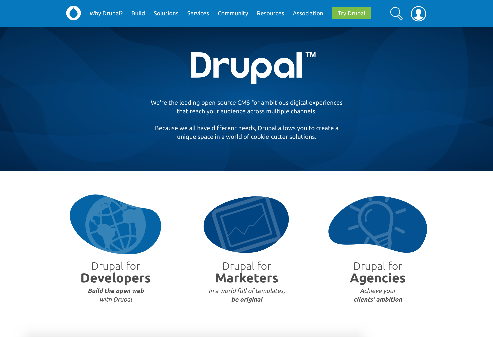

<!-- .slide: data-background="images/baltimore-splash.jpg" -->

<!-- .slide: data-background="images/amsterdam-sprint-room.jpg" data-state="show-header" data-header="Photo CC-BY Boris Baldinger https://flic.kr/p/pq711h" -->
## First time sprinter workshop
<!-- .element: class="heading invert" -->

Note:
To use presentation:
- `git clone git@github.com:drupal-mentoring/first-time-sprinter-workshop.git`
- `cd first-time-sprinter-workshop`
- `php -S localhost:8000`
- open browser [http://localhost:8000](http://localhost:8000) or [http://bit.ly/sprinter-workshop](http://bit.ly/sprinter-workshop) (network connection required)

## [http://bit.ly/2pfHjcy](http://bit.ly/2pfHjcy)

Note:
- follow along: slides and speaker notes available online

## Presenter

* <a href="https://www.drupal.org/u/user"><i class="fa fa-drupal"></i> user</a>
* <a href="https://twitter.com/twitter"><i class="fa fa-twitter"></i> twitter</a>

Note:

## Introducing ResilioSync
<!-- .element: class="heading" -->
### [drupal.org/tools](https://www.drupal.org/tools)
Note:
- Several tools to install, but network can get slow or clogged
- ResilioSync is an app for sharing files over a local network
- Prepared tools folder with an installer script
- Steps: install ResilioSync, click on the link on [drupal.org/tools](https://www.drupal.org/tools) to sync (based on your operating system)

<!-- .slide: data-background="images/amsterdam-sprint.jpg" data-state="show-header" data-header="Photo CC-BY Boris Baldinger https://flic.kr/p/paCQbD" -->
## Why are we here?
<!-- .element: class="heading invert" -->

Note:
- Why are we here?
- A sprint is a get together to do focused work for a project
- We do not work alone: 2-3 people work on the same issue

## <a href="https://www.drupal.org" target="_blank"><i class="fa fa-drupal"></i> drupal.org</a>

Note:
-

## <i class="fa fa-drupal"></i> drupal.org<a href="https://www.drupal.org/association" target="_blank">/association</a>

Note:
-

## <i class="fa fa-code"></i><a href="https://api.drupal.org" target="_blank"> api.</a>drupal.org

Note:
-

## <i class="fa fa-book"></i> drupal.org<a href="https://www.drupal.org/docs" target="_blank">/docs</a>

Note:
-

## <i class="fa fa-comments-o"></i> drupal.org<a href="https://www.drupal.org/irc" target="_blank">/irc</a>

Note:
-

## <i class="fa fa-code-fork"></i> drupal.org<a href="https://www.drupal.org/project/drupal" target="_blank">/project/drupal</a>

Note:
-

## <i class="fa fa-user"></i> drupal.org<a href="https://www.drupal.org/user/register" target="_blank">/user/register</a>

Note:
- To make the most of these sites you’ll want to have a d.o account
- If you don’t already have a d.o account lets create one now, and/or update your profile..
- Customise your dashboard.

## <i class="fa fa-wrench"></i> Contributor tools

Note:
-Many options exist, this combination was chosen to work best at a DrupalCon sprint
-Smallest filesize
-Fastest setup time on the day
-Mentors not having to support umpteen different environments

<!-- .slide: data-background="images/amsterdam-webchick.jpg" data-state="show-header" data-header="Photo CC-BY Boris Baldinger https://flic.kr/p/paCRg4" -->
## IRC
<!-- .element: class="heading" -->

Note:
- 

<!-- .slide: data-background="images/nola-editor.jpg" data-state="show-header" data-header="Photo CC-BY-SA 2.0 Michael Cannon https://flic.kr/p/GZs16Q" -->
## Editor
<!-- .element: class="heading" -->

Note:
-

<!-- .slide: data-background="images/cottser-livecommit.jpg" data-state="show-header" data-header="Photo CC-BY-SA 2.0 Michael Cannon https://flic.kr/p/GZs3LQ" -->
## git
<!-- .element: class="heading" -->

Note:
-Git is the version control system of choice for the Drupal project
-It allows us to track all the changes, merge peoples work, easily see changes & history

## git <!-- .element: style="margin-top: 8rem;" -->
<a href="https://www.drupal.org/project/drupal/git-instructions" target="_blank">drupal.org/project/drupal/git-instructions</a>

Note:
-Routine commands are almost all copy/paste
-Go read this page.. you won’t be able to test these commands until the tools are installed

<!-- .slide: data-background="images/amp-stack.jpg" -->
## AMP Stack
<!-- .element: class="heading" -->

Note:
-

## <i class="fa fa-bug"></i> drupal.org<a href="https://drupal.org/project/issues/drupal">/project/issue/drupal</a>

### Issue Queue

Note:
-Issue queues are essentially the community todo list, all project have them
-it’s where you can point out bugs or suggest improvements, and people can test and fix them
-Show advanced search and explain tags
-Do a filtered search, follow an issue
- priority: critical, major issues
- category: bug report, task, plan, support request, feature request
- status: the life cycle of an issue

<!-- .slide: data-background="images/dublin-ftsw.jpg" data-state="show-header" data-header="Photo CC-BY-SA 2.0 Michael Cannon https://flic.kr/p/MLAdCt" -->
## Sprint
<!-- .element: class="heading invert" -->

Note:
-

