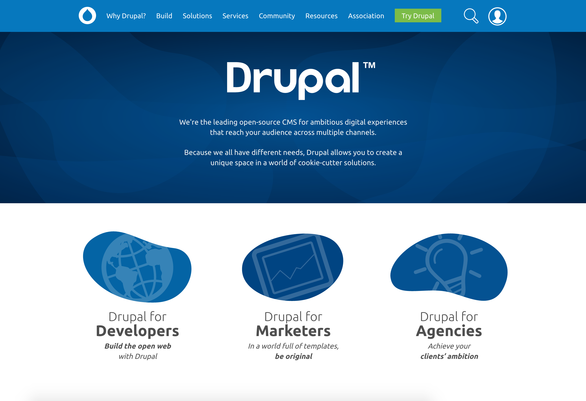

<!-- .slide: data-background="images/nashville_cover.jpg" data-state="show-header" data-header="Start syncing: drupal.org/tools" -->
<!-- .element: class="drupalcon-logo" -->

Note:
Display while people are filling the room.

<!-- .slide: data-background="images/amsterdam-sprint-room.jpg" data-state="show-header" data-header="Photo CC-BY Boris Baldinger https://flic.kr/p/pq711h" -->
## First time sprinter workshop
<!-- .element: class="heading invert" -->

Note:
To use presentation:
- `git clone git@github.com:drupal-mentoring/first-time-sprinter-workshop.git`
- `cd first-time-sprinter-workshop`
- `php -S localhost:8000`
- open browser [http://localhost:8000](http://localhost:8000) or [http://bit.ly/sprinter-workshop](http://bit.ly/sprinter-workshop) (network connection required)

<!-- .slide: data-state="show-header" data-header="Start syncing: drupal.org/tools" -->
## [http://bit.ly/2pfHjcy](http://bit.ly/2pfHjcy)

Note:
- follow along: slides and speaker notes available online

<!-- .slide: data-state="show-header" data-header="Start syncing: drupal.org/tools" -->
## Presenter

* <a href="https://www.drupal.org/u/mradcliffe"><i class="fa fa-drupal"></i> mradcliffe</a>
* <a href="https://twitter.com/mattkineme"><i class="fa fa-twitter"></i> mattkineme</a>

Note:

## Introducing ResilioSync
<!-- .element: class="heading" -->
### [drupal.org/tools](https://www.drupal.org/tools)
Note:
Explain briefly what the tools are and explain that they will need to wait while we do the presentation before the files will be ready to install. Only required for those doing local code-based tasks!! Talk through each of the available tools.
- Several tools to install, but network can get slow or clogged
- ResilioSync is an app for sharing files over a local network
- Prepared tools folder with an installer script
- Steps: install ResilioSync, click on the link on [drupal.org/tools](https://www.drupal.org/tools) to sync (based on your operating system)

<!-- .slide: data-background="images/amsterdam-sprint.jpg" data-state="show-header" data-header="Photo CC-BY Boris Baldinger https://flic.kr/p/paCQbD" -->
## Why are we here?
<!-- .element: class="heading invert" -->

Note:
- Why are we here?
- A sprint is a get together to do focused work for a project
- We do not work alone: 2-3 people work on the same issue. Your neighbors. Quick feedback loop.

## <a href="https://www.drupal.org" target="_blank"><i class="fa fa-drupal"></i> drupal.org</a>

Note:
- Some important URLs to try and remember.
- Commonly referred to as D.O. is the central site for the Drupal community.

## <i class="fa fa-drupal"></i> drupal.org<a href="https://www.drupal.org/association" target="_blank">/association</a>

Note:
- Helps the community with funding, infrastructure, education and more, you should become a member tonight if you aren't already... For as little as 15 USD.

## <i class="fa fa-code"></i><a href="https://api.drupal.org" target="_blank"> api.</a>drupal.org

Note:
- Allows you to search the complete Drupal Appliaction Programming Interface (API) docs for Drupal 4.6 through 8.3.0. This will become indispensible if you are working on core code or you start developing modules.

## <i class="fa fa-book"></i> drupal.org<a href="https://www.drupal.org/docs" target="_blank">/docs</a>
<i class="fa fa-question-circle"></i> drupal.org<a href="https://www.drupal.org/documentation" target="_blank">/documentation</a>

Note:
- Guides for pretty much everything, highlight /documentation/git
- A vital contribution is through documentation. We are migrating from /documentation to /docs. Older documentation via the link below.

## <i class="fa fa-comments-o"></i> drupal.org<a href="https://www.drupal.org/chat" target="_blank">/chat</a>

Note:
<<<<<<< HEAD
=======
- Drupal Slack.
>>>>>>> nashville-2018
- IRC which is linked from support is somewhat important for those contributing to the drupal project, I will elaborate on this in a little bit.
- There are other ways of communication, but IRC is still the dejure standard in the community.

## <i class="fa fa-code-fork"></i> drupal.org<a href="https://www.drupal.org/project/drupal" target="_blank">/project/drupal</a>

Note:
- Drupal core is located at slash project slash drupal.
- Each module, theme and core itself is located from slash project and the short name of the project. Sometimes the short name does not match the actual title such as "Display Suite".

## <i class="fa fa-user"></i> drupal.org<a href="https://www.drupal.org/user/register" target="_blank">/user/register</a>

Note:
- To make the most of these sites you’ll want to have a d.o account
- If you don’t already have a d.o account lets create one now, and/or update your profile..
- Customise your dashboard.

## <i class="fa fa-bug"></i> drupal.org<a href="https://drupal.org/project/issues/drupal">/project/issue/drupal</a>

### Issue Queue

Note:
-Issue queues are essentially the community todo list, all project have them
-it’s where you can point out bugs or suggest improvements, and people can test and fix them
-Show advanced search and explain tags
-Do a filtered search, follow an issue
- priority: critical, major issues
- category: bug report, task, plan, support request, feature request
- status: the life cycle of an issue
- tags: Novice

## <i class="fa fa-wrench"></i> Contributor tools

Note:
-Many options exist, this combination was chosen to work best at a DrupalCon sprint
-Smallest filesize
-Fastest setup time on the day
-Mentors not having to support umpteen different environments

<!-- .slide: data-background="images/amsterdam-webchick.jpg" data-state="show-header" data-header="Photo CC-BY Boris Baldinger https://flic.kr/p/paCRg4" -->
## Chat
<!-- .element: class="heading" -->

Note:
- Drupal Slack and Internet Relay Chat (IRC) is our primary communication method besides the issue queue.
- In the last 9 months, other methods such as Slack and Gittr have also been used within the community, but the dejure standard is still IRC for now.
- Nicknames: good to match d.o. username.

## Slack: drupal.org/chat
### #contribute

## IRC: Local URL
### #drupal-contribute
### #drupalcon

If you are not doing local dev or tools not synced

* MacOS: <a href="https://limechat.net/mac" target="_blank" title="MacOS: LimeChat">limechat.net/mac</a>
* Win/*nix: <a href="https://hexchat.github.io" target="_blank" title="Windows or Unix: Hexchat">hexchat.github.io</a>

Note:
- The IRC channels you'll need today are...

<!-- .slide: data-background="images/nola-editor.jpg" data-state="show-header" data-header="Photo CC-BY-SA 2.0 Michael Cannon https://flic.kr/p/GZs16Q" -->
## Editor
<!-- .element: class="heading" -->

Note:
- An editor allows you to make changes to Drupal code.
- The Community Tools installation installs Cloud 9 IDE which is a basic text editor for web development. Your own Integrated Development Environment (IDE) may be better suited.

<!-- .slide: data-background="images/cottser-livecommit.jpg" data-state="show-header" data-header="Photo CC-BY-SA 2.0 Michael Cannon https://flic.kr/p/GZs3LQ" -->
## git
<!-- .element: class="heading" -->

Note:
-Git is the version control system of choice for the Drupal project
-It allows us to track all the changes, merge peoples work, easily see changes & history

## git <!-- .element: style="margin-top: 8rem;" -->
<a href="https://www.drupal.org/project/drupal/git-instructions" target="_blank">drupal.org/project/drupal/git-instructions</a>

Note:
-Routine commands are almost all copy/paste
-Go read this page.. you won’t be able to test these commands until the tools are installed

<!-- .slide: data-background="images/mumbai-sprint.jpg" data-state="show-header" data-header="Photo CC BY-NC 2.0 Nitesh Kumar https://flic.kr/p/DrKbeu" class="vertical" -->
## Sprint
<!-- .element: class="heading bottom" -->

Note:
-

